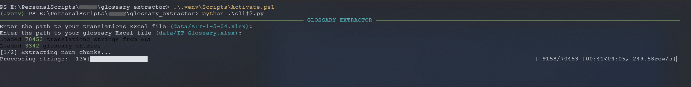

# 📚 Glossary Extractor for Localization QA

> Extract recurring noun phrases from English source strings to build or enhance your bilingual glossary (EN > IT), with real context examples.

---

## ✨ Overview

This tool is designed to support **Localization Quality Assurance (LQA)** and **Translation Memory (TM) management** by programmatically identifying candidate terms for glossary inclusion.

It leverages `spaCy` for NLP-based noun chunking and `pandas` for filtering, with progress tracking via `tqdm`. Output terms include real examples from source and target strings, and can be checked against an existing glossary for overlap.

---

## 🧠 Use Case

Large projects often suffer from **inconsistent terminology** or **missing glossary entries**. This tool helps:

- Detect high-frequency candidate terms in EN source text.
- Review them with real EN/IT sentence pairs.
- Identify gaps or mismatches in your current glossary.

Ideal for **PMs, linguists, and LQA specialists** working on games, apps, or any high-volume localization project.



---

## ⚙️ Features

- 🔍 **Noun phrase extraction** from EN source strings
- 📈 Frequency filtering (customizable)
- 🔤 Support for multi-word expressions (n-grams)
- ✅ Check against existing glossary (EN > IT)
- 🧹 Rejects noisy/invalid terms and logs them
- 💬 Outputs context-rich examples for human validation
- 📦 Export to CSV for review or integration into glossaries

---

## 📂 Input Format

You will need an Excel file with at least these two columns:

| EN                  | Italian              |
|---------------------|----------------------|
| The final boss is here! | Il boss finale è qui! |

Optionally, provide a second glossary file with:

| en Term1     | it Term1     |
|--------------|--------------|
| final boss   | boss finale  |

---

## 🏁 How to Use

1. Clone this repo  
2. Install dependencies  
   ```bash
   pip install -r requirements.txt
3. ```bash
   python cli#2.py
4. Follow the prompts to input:
  - Your Translation Excel File
  - Your Glossary file
5. View your results:
  - terms_filtered.xlsx -> Cleaned candidates
  - rejected_terms.xlsx -> Filtered-out noisy terms

---

📌 Notes
- Language model: spaCy en_core_web_sm
- Current language pair: EN > IT
- Extendable to other pairs with simple tweaks

---
📬 Contributors
Leoth — Localization QA Specialist @ Moonton 
